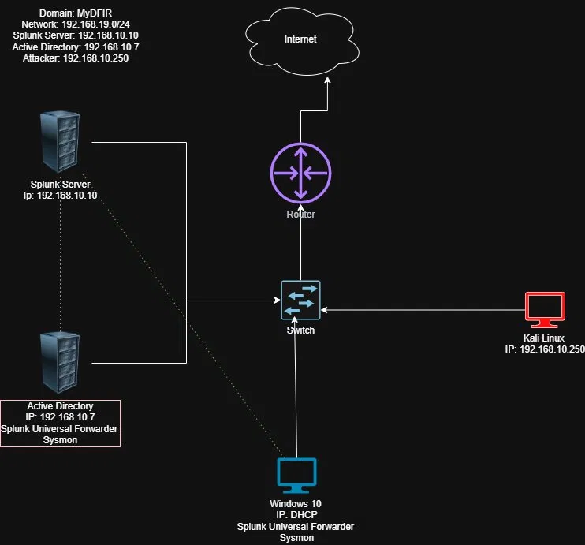
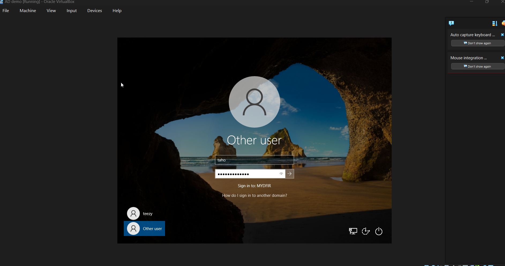
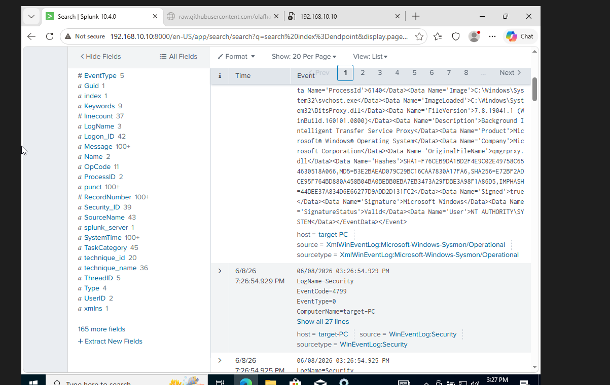
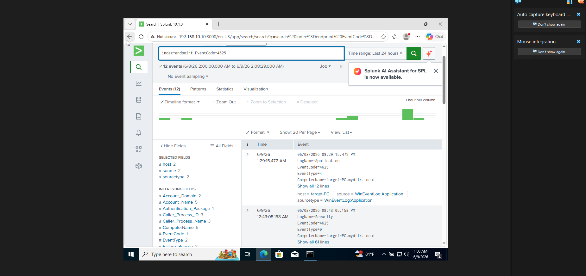
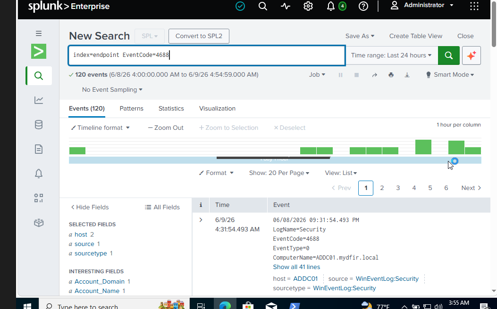
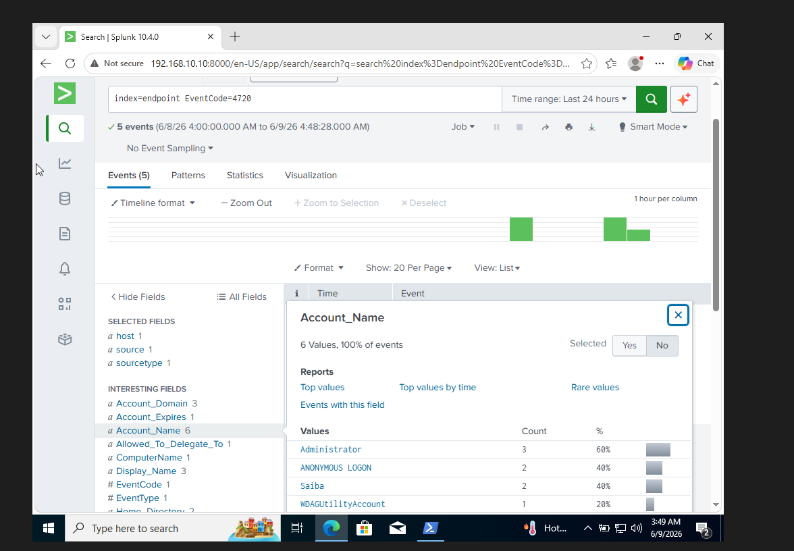

# Active Directory SOC Home Lab

## Threat Detection and Log Analysis in a Simulated Enterprise Environment

This project documents the design, deployment, and operation of a simulated enterprise Security Operations Center (SOC) lab. The environment was built using Active Directory, Splunk Enterprise, Sysmon, Splunk Universal Forwarder, Windows Server, Windows 10, and Kali Linux.

The goal of this lab was to build an enterprise-style domain environment, generate attack activity, collect endpoint telemetry, and analyze security events in Splunk using SOC-style investigation workflows.

---

## Skills Demonstrated

* Active Directory domain setup and endpoint joining
* Splunk Enterprise deployment and log ingestion
* Sysmon telemetry collection
* Windows Event Log analysis
* SPL query development
* Brute-force detection
* Process creation monitoring
* Account creation detection
* MITRE ATT&CK mapping
* SOC triage and incident investigation
* Endpoint visibility and detection engineering

---

## Tools Used

| Tool                       | Purpose                            |
| -------------------------- | ---------------------------------- |
| Oracle VirtualBox          | Virtualized lab environment        |
| Windows Server 2022        | Active Directory domain controller |
| Windows 10 Pro             | Domain-joined endpoint             |
| Ubuntu Server              | Splunk Enterprise server           |
| Splunk Enterprise          | SIEM and log analysis              |
| Splunk Universal Forwarder | Windows log forwarding             |
| Sysmon                     | Endpoint telemetry collection      |
| Kali Linux                 | Attacker machine                   |
| Crowbar                    | RDP brute-force simulation         |
| Atomic Red Team            | MITRE ATT&CK technique simulation  |

---

## Lab Architecture

The lab was built as a four-machine enterprise-style environment. The domain controller managed the `MYDFIR` domain, the Windows 10 endpoint was joined to the domain, Splunk collected logs from the Windows systems, and Kali Linux was used to simulate attacker activity.



### Environment Summary

| System              | Role                               | IP Address     |
| ------------------- | ---------------------------------- | -------------- |
| Ubuntu Server       | Splunk SIEM                        | 192.168.10.10  |
| Windows Server 2022 | Active Directory Domain Controller | 192.168.10.7   |
| Windows 10 Pro      | Domain-joined endpoint             | 192.168.10.100 |
| Kali Linux          | Attacker machine                   | 192.168.10.250 |

---

## Active Directory Configuration

Windows Server 2022 was configured as the Active Directory domain controller for the `MYDFIR` domain. Organizational Units were created to simulate a realistic enterprise structure, including separate IT and HR groups.


The Windows 10 endpoint was successfully joined to the `MYDFIR` domain and authenticated using domain credentials.



---

## Splunk Log Ingestion

Splunk Enterprise was deployed as the SIEM for the lab. A dedicated `endpoint` index was created to receive logs from the Windows domain controller and endpoint.


Sysmon and Windows Security logs were forwarded into Splunk using the Splunk Universal Forwarder. The logs included Windows Security events and Sysmon telemetry from the domain-joined endpoint.



---

## Attack Simulation and Detection Engineering

Attack activity was generated in the lab to practice detecting adversary behavior through Windows logs and Splunk searches.

---

### Credential Attack Simulation — RDP Brute-Force Attempt

To simulate credential-based attack activity, Kali Linux was used to run Crowbar against the Windows 10 domain-joined endpoint over RDP. The target endpoint was `192.168.10.100` on port `3389`.

Although the brute-force attempt did not return valid credentials, it generated failed authentication telemetry that could be investigated in Splunk.

```bash
crowbar -b rdp -u saiba -C passwords.txt -s 192.168.10.100/32
```


---

### Failed Logon Detection — EventCode 4625

The RDP brute-force attempt generated Windows failed logon events. These were detected in Splunk using EventCode 4625, which is commonly used by SOC analysts to identify failed authentication attempts, password spraying, brute-force behavior, and suspicious login activity.

```spl
index=endpoint EventCode=4625
```



This detection maps to **MITRE ATT&CK T1110 — Brute Force**.

---

### Process Creation Monitoring — EventCode 4688

Windows Security EventCode 4688 was used to monitor process creation activity. This type of telemetry is useful for identifying suspicious command execution, unusual process behavior, and attacker activity on endpoints.

```spl
index=endpoint EventCode=4688
```



---

### Atomic Red Team Simulation — Account Creation Persistence

Atomic Red Team was used to simulate account creation behavior associated with persistence. The lab executed **T1136.001 — Create Account: Local Account**, which creates a new local user and adds it to the local Administrators group.


This activity is important because adversaries may create new accounts after gaining access to maintain persistence inside an environment.

---

### Account Creation Detection — EventCode 4720

After executing the Atomic Red Team test, Splunk was used to search for Windows EventCode 4720, which indicates that a new user account was created.

```spl
index=endpoint EventCode=4720
```



This detection maps to **MITRE ATT&CK T1136.001 — Create Account: Local Account**.

---

## Key Findings

* Built and operated a functional Active Directory SOC lab with centralized log collection.
* Confirmed successful domain configuration and endpoint domain join.
* Forwarded Windows Security and Sysmon logs into Splunk.
* Generated attack activity using Kali Linux, Crowbar, and Atomic Red Team.
* Created SPL searches for failed logons, process creation, and account creation activity.
* Practiced SOC-style triage by connecting simulated attack behavior to Windows Event IDs.
* Mapped detection activity to MITRE ATT&CK techniques.

---

## What I Learned

This project strengthened my understanding of how enterprise environments generate security telemetry and how SOC analysts investigate that activity. Building the lab from scratch helped me understand both the administrative side of Active Directory and the detection side of Splunk-based monitoring.

The most valuable part of the project was seeing how attacker behavior appears in logs. Instead of only reading about Event IDs, I generated activity, searched for it in Splunk, and analyzed the results like a SOC analyst would during an investigation.

---

## Full Technical Writeup

A full PDF writeup with detailed setup steps, screenshots, SPL searches, attack simulations, and analysis is included in this repository.

[View Full Writeup](./AD_SOC_Lab_WriteUp_v3.pdf)
