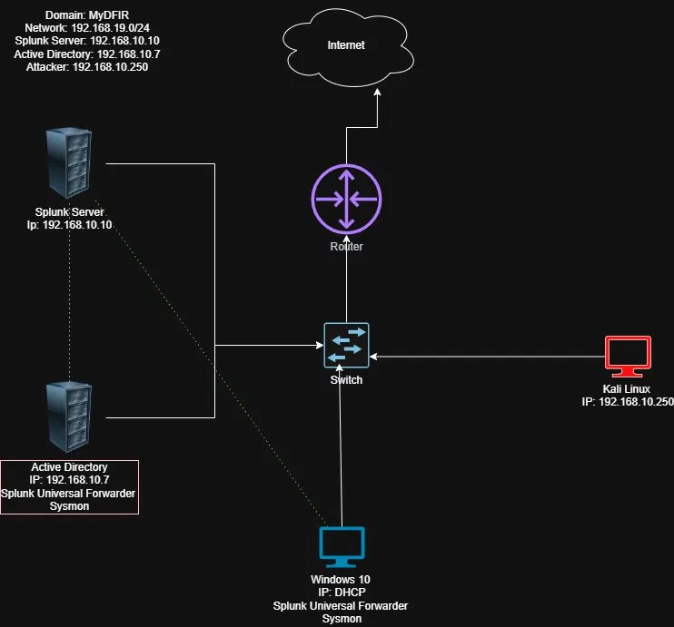
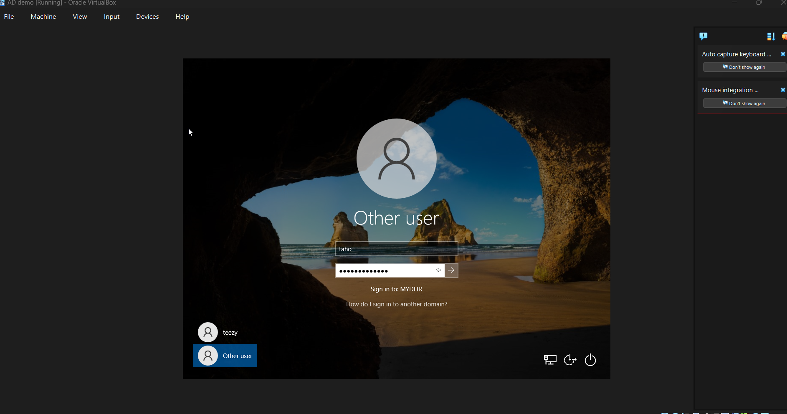
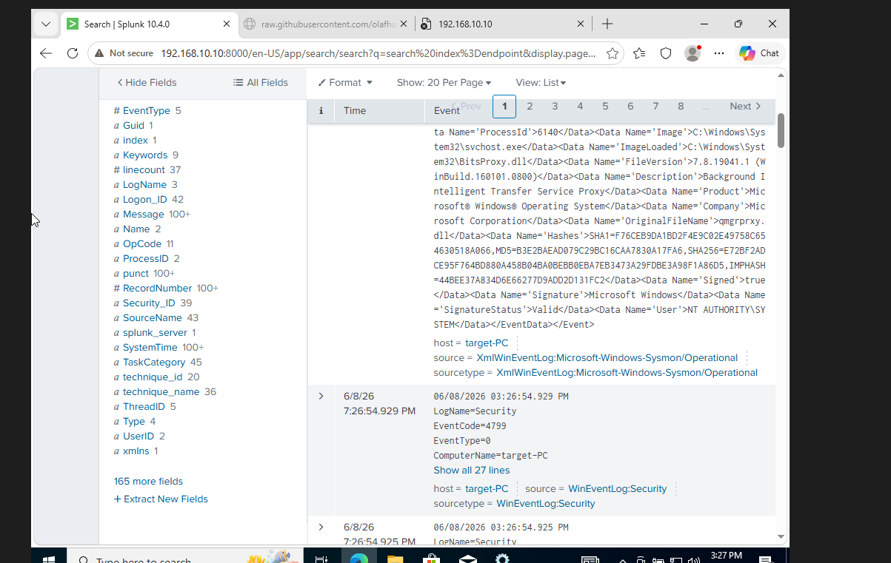
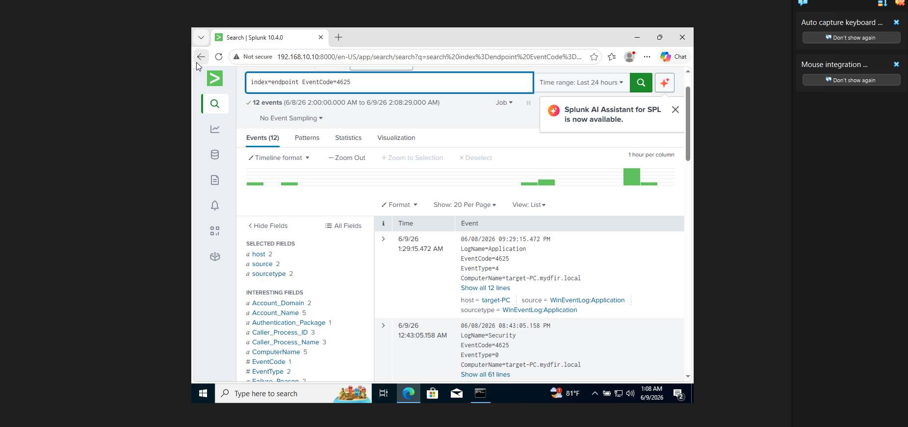
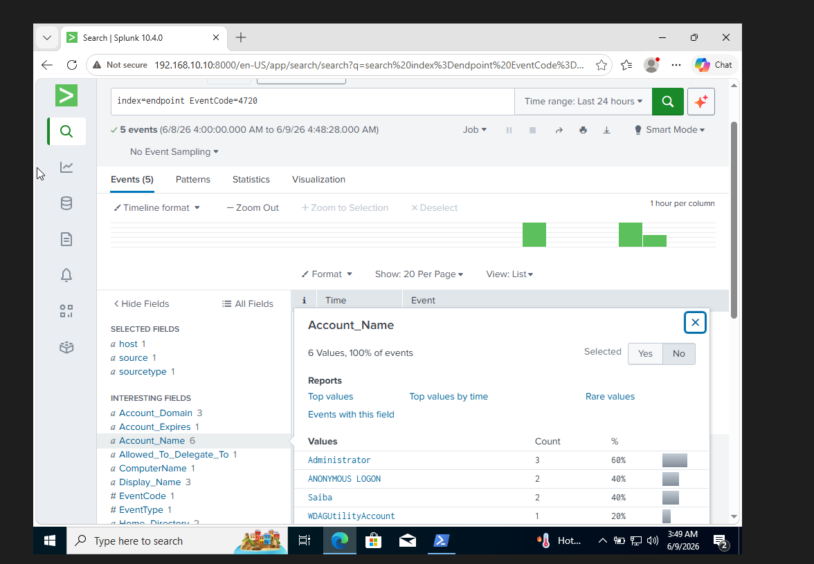
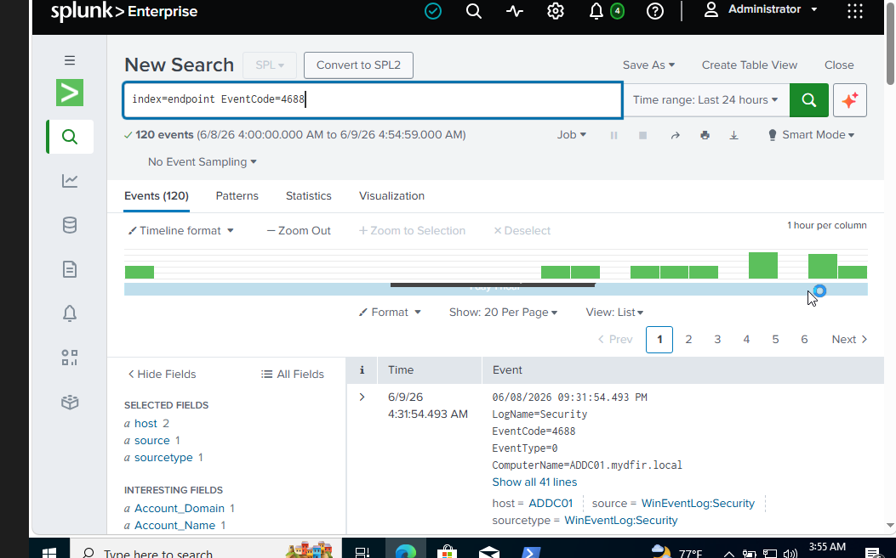

# Active Directory SOC Home Lab
 
Active Directory environment built in VirtualBox and monitored with Splunk. A Kali attacker runs a Crowbar RDP brute force and Atomic Red Team ATT&CK simulations against a domain-joined Windows 10 endpoint, Sysmon and the Splunk Universal Forwarder ship the telemetry, and custom SPL queries detect the activity by event code.
 
**Stack:** VirtualBox · Windows Server 2022 (AD DS) · Splunk Enterprise 10.4 · Sysmon (Olaf Hartong config) · Kali Linux · Crowbar · Atomic Red Team
 
**Full write-up:** [AD_SOC_Lab_WriteUp.pdf](AD_SOC_Lab_Writeup.pdf) covers the full build, attack simulations, and SPL detection logic in depth.
 
## Lab Environment
 
| Machine | Role | IP | Key Tools |
|---|---|---|---|
| Ubuntu Server 22.04 | Splunk SIEM | 192.168.10.10 | Splunk Enterprise 10.4 |
| Windows Server 2022 | Domain Controller (ADDC01) | 192.168.10.7 | Sysmon + Universal Forwarder |
| Windows 10 Pro | Target Endpoint | 192.168.10.100 | Sysmon + Universal Forwarder |
| Kali Linux 2024 | Attacker Machine | 192.168.10.250 | Crowbar, Atomic Red Team |
 
All four machines run on a single VirtualBox NAT network (192.168.10.0/24) with static IPs. Sysmon and the Splunk Universal Forwarder were deployed to both Windows machines so activity on the domain controller and the endpoint were both visible to the SIEM.
 
## Attack Simulations
 
- **RDP brute force (Crowbar):** A password list built from the top 20 entries of rockyou.txt, with the correct password appended, was run against the target over RDP. 12 failed logons landed in a sub-second window before the correct credential succeeded.
- **T1136.001, local account creation:** Atomic Red Team created a local administrator account (NewLocalUser), confirmed it, then deleted it, simulating a backdoor an attacker would use to maintain access.
- **T1059.001, PowerShell execution:** Atomic Red Team attempted Mimikatz and BloodHound via PowerShell. Windows Defender blocked the Mimikatz execution, but the attempt still generated process creation events.
## Detection
 
| Detection | MITRE Technique | Event Code | Key Field | Threshold Logic |
|---|---|---|---|---|
| Brute Force | T1110 | 4625 | src_ip count | count > 10 failures |
| Persistence | T1136.001 | 4720 | Subject_Account_Name | Any new account creation |
| Execution | T1059.001 | 4688 | Creator_Process_Name | PowerShell/cmd.exe parent > 5 events |
 
The account-creation event (4720) persisted in Splunk even after the account was deleted, and the blocked Mimikatz attempt still logged a process creation event (4688), confirming detection does not depend on the attack succeeding or the account still existing.
 
## Analyst Output
 
- [INC-2026-001 Incident Summary](INC-2026-001_Incident_Summary.pdf): multi-stage intrusion report covering brute force, persistence, execution, and account discovery, mapped to four MITRE ATT&CK techniques.
## Screenshots
 
| | |
|---|---|
|  Lab topology |  Domain join |
|  Splunk log ingestion |  Failed logon detection |
|  Account creation detection |  Process creation monitoring |
 
## Repository Contents
 
- `README.md`
- `AD_SOC_Lab_WriteUp.pdf`
- `INC-2026-001_Incident_Summary.pdf`
- `images/`
## Key Takeaway
 
This lab gave me hands-on experience standing up an Active Directory environment, centralizing its telemetry in Splunk, and writing SPL detections against real attacker behavior instead of relying on default logging. Building and attacking the same environment made the value of specific, field-anchored detection logic concrete rather than theoretical.
 
